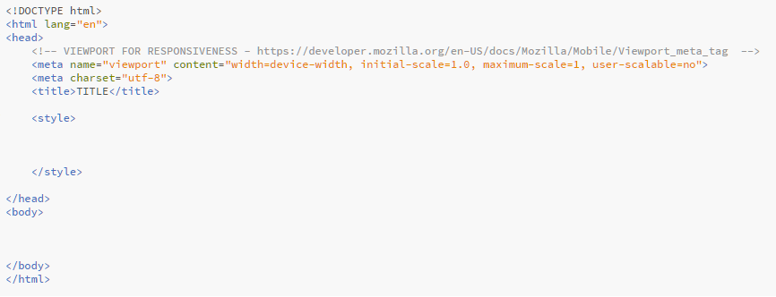
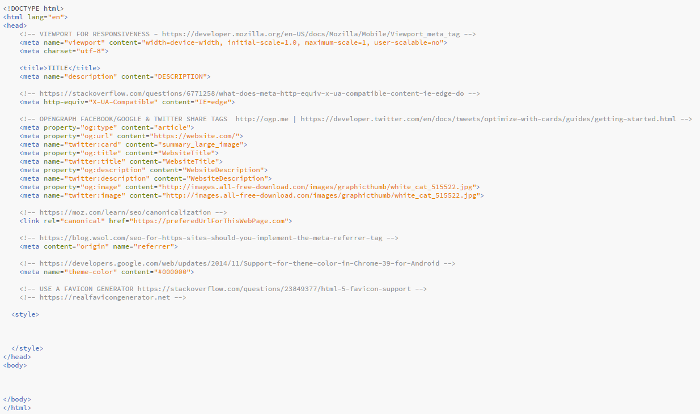

# HTML5 SKELETONS

Two html files in this repo corresponding to the following:

### Basic skeleton:

> (Title, Viewport & Charset)

### Full skeleton:

> (Title,Viewport,Charset,Description,IE-compatibility,Open Graph + Twitter, Canonical, Origin & Theme-color (for android menus)

